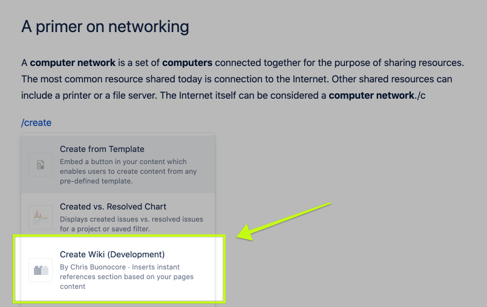
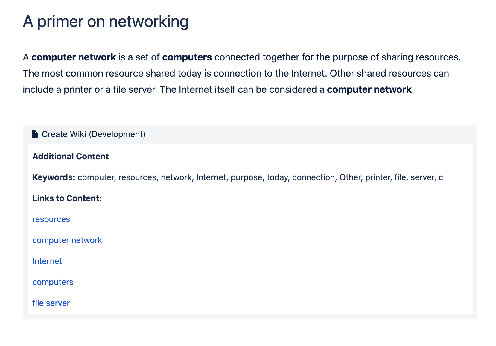
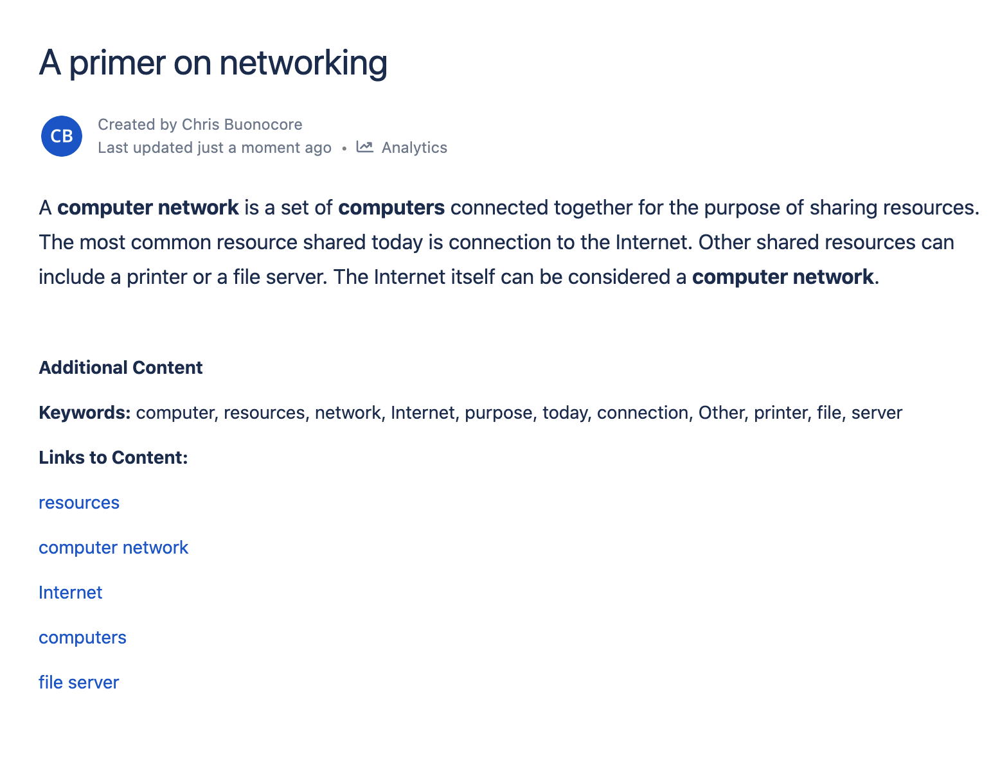
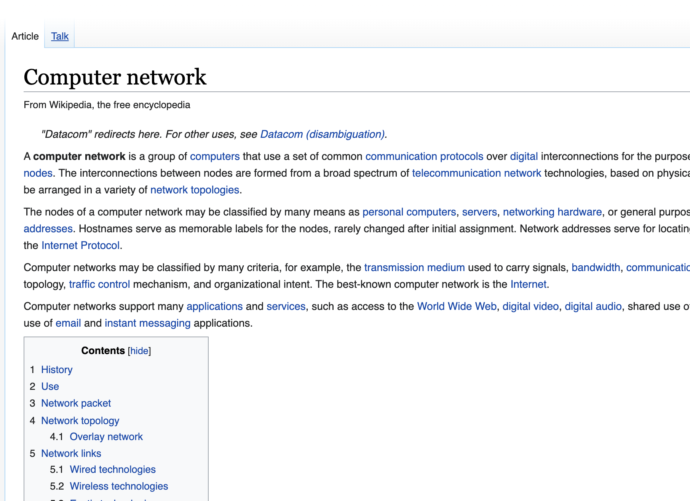

    

# Instant Wiki

Forge Atlassian app that enables automatic insertion of a keywords section and a variety of relevant article links to the bottom of any page.

Search for the `instant-wiki` forge app

Invoke via `/Create wiki`

## Instant Wiki

Use NLP to extract an automatic and dynamically updated references and keywords section to the end of any Confluence article.

Built on Atlassian Forge.

## Inspiration

- Many times you may be writing documentation for items where additional content/references might be useful
- Extracting keywords can help a reader get a quick feel for the gist of a long article, and improve potential search results

## What it does

- Instant Wiki is a macro that automatically adds an appendix section to any Confluence article
- Uses basic NLP to extract core phrases and topics out of an article
- Generates automatic wikipedia links for additional information on any of the extracted key phrases from the article.

## How I built it

- Macro parses out the paragraph (body) content of the article.
- Content is run through a modern NLP javascript engine from retextjs (https://github.com/retextjs/retext) and finds core elements.
- The core themes and keywords are separated out from the current article and rendered into a simple to understand appendix section for your article

## Challenges I ran into

- There wasn't a formal API for extracting the plain text out of a confluence article. I had to build a processing function to enable parsing through the formatted confluence markdown to get the relevant content.

## Accomplishments that I'm proud of

It works

## What I learned

How to build a "serverless" forge app and leverage the confluence API to pull article data

## What's next for Instant Wiki

The goal of the Instant Wiki would be to save any potential time needed to generate an appendix of content for an article.

- Add more configurable options for the wiki footer content
- Link to other sources beyond Wikipedia. Recommend additional content suggestions based on the parsed text and body from the Confluence page.
- Parse through the user's Confluence space to find other articles that might be relevant to the current one being read.

### Screenshots

 

 

 

